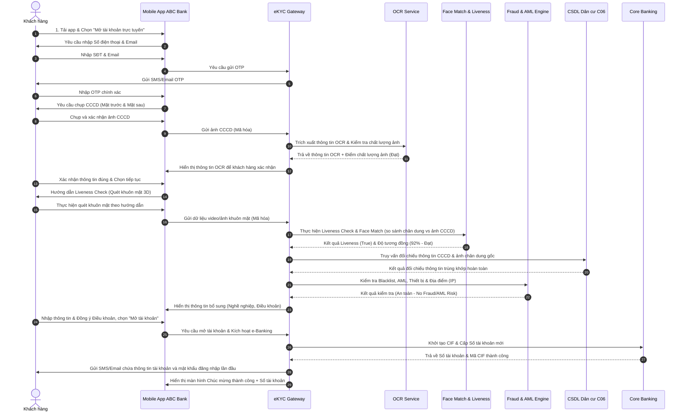

# TÀI LIỆU YÊU CẦU NGHIỆP VỤ (BRD) - HỆ THỐNG MỞ TÀI KHOẢN TRỰC TUYẾN (eKYC) - ABC BANK

## THÔNG TIN CHUNG
- **Tên dự án:** Hệ thống Mở tài khoản trực tuyến qua định danh điện tử (eKYC) - ABC Bank
- **Phiên bản:** v1.0
- **Ngày lập:** 2026-07-02
- **Tác giả:** Senior Business Analyst (FinTech & Digital Banking)
- **Mục tiêu chiến lược:** Đạt tỷ lệ tự động hóa tối đa, hướng tới "Zero manual operation" (không cần phê duyệt thủ công của con người tại thời điểm mở tài khoản), tối ưu hóa trải nghiệm khách hàng và đảm bảo tuân thủ 100% quy định của Ngân hàng Nhà nước Việt Nam.

---

## 1. ACTORS (TÁC NHÂN HỆ THỐNG)
Dưới đây là danh sách toàn bộ tác nhân tham gia trực tiếp và gián tiếp vào hệ thống mở tài khoản trực tuyến:

| Phân nhóm | Tác nhân (Actor) | Vai trò & Nhiệm vụ trong luồng nghiệp vụ |
| :--- | :--- | :--- |
| **Trực tiếp** | **Khách hàng (Customer)** | - Chủ thể thực hiện đăng ký mở tài khoản. - Cung cấp thông tin liên hệ, chụp ảnh giấy tờ (CCCD) và thực hiện xác thực khuôn mặt (Liveness Check) trên Mobile App. |
| | **ABC Bank Mobile App** | - Giao diện đầu cuối (Front-end) tương tác với khách hàng. - Thu thập thông tin, chụp ảnh giấy tờ, quét khuôn mặt, đọc NFC chip (nếu có), truyền dữ liệu mã hóa về Backend qua API. |
| **Hệ thống nội bộ ABC Bank** | **eKYC Gateway** | - Hệ thống trung gian (orchestrator) điều phối các cuộc gọi dịch vụ giữa App, OCR, Liveness, CSDL C06, CoreBank và Fraud Detection. |
| | **Hệ thống OCR Service** | - Tự động trích xuất thông tin chữ và số từ ảnh chụp CCCD. - Đánh giá chất lượng ảnh giấy tờ (chói sáng, mất góc, mờ). |
| | **Hệ thống Face Match & Liveness** | - So sánh khuôn mặt thực tế chụp qua Liveness Check với ảnh trên CCCD và ảnh từ CSDL C06. - Xác thực thực thể sống (liveness check) để chống gian lận giả mạo bằng ảnh chụp/video/deepfake. |
| | **Fraud & AML Engine** | - Hệ thống phân tích phòng chống gian lận và rửa tiền tự động. - Kiểm tra thiết bị, địa chỉ IP, danh sách đen (Blacklist/PEP) và các hành vi bất thường của khách hàng. |
| | **Core Banking System (CoreBank)** | - Khởi tạo hồ sơ khách hàng (CIF), mở số tài khoản thanh toán mới. - Quản lý trạng thái tài khoản và hạn mức giao dịch ban đầu. |
| | **SMS/Email Gateway** | - Gửi mã xác thực OTP, gửi thông báo cấp số tài khoản và thông tin đăng nhập dịch vụ Ngân hàng số thành công. |
| **Bên thứ ba / Cơ quan quản lý** | **Cơ sở dữ liệu Quốc gia về Dân cư (C06 - BCA)** | - Xác thực thông tin cá nhân và ảnh chân dung gốc của chủ thẻ CCCD gắn chip qua kênh kết nối API trực tiếp của Bộ Công an. |
| | **Hệ thống CIC (Credit Information Center)** | - Tra cứu thông tin điểm tín dụng và lịch sử nợ xấu của khách hàng (nếu cần thiết lập hạn mức thấu chi hoặc phân loại rủi ro khách hàng). |
| | **Back-office / Compliance (Hậu kiểm)** | - Không tham gia vào luồng mở tài khoản trực tuyến (Zero manual operation tại thời gian thực). - Chỉ tham gia hậu kiểm định kỳ hoặc xử lý các khiếu nại, tra soát hệ thống định kỳ. |

---

## 2. BUSINESS FLOW (LUỒNG NGHIỆP VỤ CHI TIẾT)

### 2.1 Luồng chuẩn (Happy Path) - Quy trình tự động hóa 100% (Zero Manual Operation)

#### Mô tả chi tiết từng bước (Step-by-step) của Happy Path:
1. **Bước 1: Tiếp cận**: Khách hàng tải ứng dụng ABC Bank từ App Store/Google Play. Chọn chức năng "Mở tài khoản trực tuyến".
2. **Bước 2: Xác minh liên hệ**: Nhập Số điện thoại và Email. Hệ thống gửi mã OTP (6 chữ số, hiệu lực 2 phút) qua SMS/Email. Khách hàng nhập OTP để xác minh sở hữu số điện thoại.
3. **Bước 3: Chụp CCCD**: Ứng dụng hướng dẫn chụp mặt trước và mặt sau của CCCD. Camera tự động bắt khung hình, kiểm tra độ sáng, độ nét để đảm bảo chất lượng ảnh tốt nhất.
4. **Bước 4: Xử lý OCR**: Ảnh chụp được gửi lên OCR Service để phân tích chữ viết, trích xuất các trường dữ liệu tĩnh. Dữ liệu trích xuất hiển thị trên App. Khách hàng kiểm tra và xác nhận (không cho phép sửa các trường thông tin cốt lõi để đảm bảo tính toàn vẹn của eKYC).
5. **Bước 5: Xác thực khuôn mặt (Liveness Check)**: Khách hàng thực hiện các hành động quay trái, quay phải, nhìn thẳng theo chỉ dẫn trên màn hình để kiểm tra thực thể sống (Active Liveness). Hệ thống đồng thời chụp các frame hình chất lượng cao nhất.
6. **Bước 6: So khớp khuôn mặt (Face Matching)**: Face Match Service so sánh ảnh chân dung chụp từ Liveness Check với ảnh quét được trên CCCD. Độ tương đồng tối thiểu phải đạt $\ge 85\%$.
7. **Bước 7: Xác thực cơ sở dữ liệu quốc gia (C06 - BCA)**: Hệ thống eKYC Gateway gửi số CCCD và ảnh khuôn mặt/thông tin định danh lên hệ thống kết nối C06 của Bộ Công an để đối chiếu. Trả về kết quả xác nhận thông tin CCCD là thật và khuôn mặt đúng là của chủ thẻ.
8. **Bước 8: Kiểm tra rủi ro (Fraud & AML Detection)**: Hệ thống tự động kiểm tra xem khách hàng có nằm trong danh sách đen (Blacklist), danh sách cấm vận, chính trị gia PEP (Politically Exposed Persons) hay không. Đồng thời kiểm tra thông tin thiết bị (Rooted/Jailbroken, Mock GPS) và dải IP.
9. **Bước 9: Xác nhận và Đăng ký**: Khách hàng bổ sung một số thông tin bắt buộc khác như nghề nghiệp, chức vụ, đồng thời chọn loại tài khoản mong muốn, xác nhận đồng ý với các điều khoản điều kiện của ABC Bank.
10. **Bước 10: Tạo tài khoản trên Core Banking**: eKYC Gateway gọi API tạo CIF (Hồ sơ khách hàng) và tạo tài khoản thanh toán tự động trên Core Banking. Kích hoạt tài khoản trực tuyến với hạn mức ban đầu phù hợp quy định của Ngân hàng Nhà nước.
11. **Bước 11: Bàn giao tài khoản**: Số tài khoản hiển thị trên màn hình Mobile App. Thông tin đăng nhập dịch vụ ngân hàng số cùng mật khẩu tạm thời được gửi qua SMS/Email bảo mật cho khách hàng. Quy trình kết thúc.

---

### 2.2 Các nhánh rẽ xử lý lỗi (Exception Flows & Error Handling)
Nhằm đạt mục tiêu **Zero manual operation**, hệ thống cần có cơ chế xử lý lỗi tự động thông minh, hướng dẫn khách hàng tự khắc phục ngay trên ứng dụng thay vì chuyển sang phê duyệt thủ công.

| Mã lỗi | Tình huống lỗi (Scenario) | Hành vi của Hệ thống (System Action) | Hướng xử lý đề xuất cho Người dùng |
| :--- | :--- | :--- | :--- |
| **ERR_OTP_001** | Nhập sai OTP quá 3 lần liên tiếp. | Khóa luồng xác thực số điện thoại hiện tại trong vòng 15 phút. | Thông báo: *"Bạn đã nhập sai mã OTP quá số lần quy định. Vui lòng thử lại sau 15 phút."* |
| **ERR_OCR_001** | Ảnh chụp CCCD không đạt chất lượng (mờ, chói sáng, mất góc). | Hệ thống phát hiện điểm chất lượng ảnh dưới ngưỡng cho phép ($< 80\%$) và tự động hủy yêu cầu OCR. | Yêu cầu người dùng chụp lại: *"Ảnh chụp bị mờ/chói sáng. Vui lòng đặt giấy tờ trong khung hình, chụp ở nơi đủ ánh sáng và không bị lóa."* |
| **ERR_OCR_002** | Giấy tờ hết hạn sử dụng. | OCR trích xuất ngày hết hạn và so sánh với ngày hiện tại của hệ thống. Nếu hết hạn, chặn luồng ngay lập tức. | Thông báo: *"Giấy tờ tùy thân của bạn đã hết hạn sử dụng. Vui lòng sử dụng giấy tờ còn hiệu lực hoặc liên hệ chi nhánh ABC Bank gần nhất."* |
| **ERR_OCR_003** | Phát hiện giấy tờ giả mạo (Fake ID, in màu, chụp qua màn hình). | Thuật toán Anti-spoofing phát hiện chất liệu giấy tờ bất thường, viền cắt hoặc dấu hiệu photoshop. Hệ thống tự động ghi nhận mã rủi ro (Risk Code) mức High. | Chặn luồng đăng ký trực tuyến vĩnh viễn với thông tin này. Thông báo chung chung bảo mật: *"Hệ thống không thể xác minh giấy tờ của bạn. Vui lòng mang giấy tờ gốc đến chi nhánh để được hỗ trợ."* |
| **ERR_LIVE_001** | Liveness Check thất bại (phát hiện giả lập video, mặt nạ, ảnh tĩnh). | Thuật toán Liveness từ chối xác thực. Đếm số lần thực hiện lỗi của phiên giao dịch. | Yêu cầu thực hiện lại: *"Phát hiện hành động không hợp lệ. Vui lòng giữ thiết bị ngang tầm mắt và thực hiện lại theo đúng chỉ dẫn."* |
| **ERR_LIVE_002** | Vượt quá số lần Liveness Check lỗi (quá 3 lần). | Khóa tạm thời luồng eKYC của khách hàng trên thiết bị đó trong vòng 24 giờ. | Thông báo: *"Bạn đã thực hiện xác thực khuôn mặt không thành công quá số lần quy định. Vui lòng thử lại sau 24 giờ."* |
| **ERR_MATCH_001**| Điểm tương đồng khuôn mặt (Face Match Score) $< 85\%$. | So sánh ảnh chụp thực tế với ảnh CCCD/CSDL C06 có điểm số thấp (do khách hàng thay đổi ngoại hình, phẫu thuật thẩm mỹ, trang điểm đậm). | Thông báo: *"Khuôn mặt không khớp với ảnh trên giấy tờ tùy thân. Vui lòng thực hiện lại trong điều kiện ánh sáng tốt và không đeo kính râm/khẩu trang."* |
| **ERR_FRAUD_001**| Khách hàng thuộc danh sách đen (Blacklist/PEP) hoặc thiết bị có dấu hiệu gian lận (Rooted/Jailbreak/Mock GPS). | Hệ thống Fraud Detection đánh giá mức độ rủi ro là nguy hiểm. Chặn ngay luồng eKYC, lưu log hệ thống để phục vụ điều tra. | Từ chối mở tài khoản trực tuyến: *"Yêu cầu mở tài khoản trực tuyến không thể thực hiện được vào lúc này. Quý khách vui lòng mang CCCD đến chi nhánh ABC Bank để mở tài khoản trực tiếp."* |
| **ERR_SYS_001** | Mất kết nối CSDL Quốc gia C06 hoặc Core Banking. | eKYC Gateway ghi nhận lỗi kết nối hệ thống. | Lưu lại trạng thái giao dịch nháp (Draft) và thông báo khách hàng: *"Hệ thống đang bận xử lý hoặc bảo trì. Vui lòng thử lại sau ít phút."* |

---

## 3. FUNCTIONAL REQUIREMENTS (YÊU CẦU CHỨC NĂNG)

Dưới đây là bảng yêu cầu chức năng chi tiết được chia theo từng phân hệ xử lý nghiệp vụ:

### Phân hệ 1: Đăng ký & Xác thực thông tin liên hệ (Registration)
- **FR-REG-01: Thu thập thông tin liên hệ**
  - *Mô tả*: Cho phép khách hàng nhập Số điện thoại di động và địa chỉ Email.
  - *Quy tắc hệ thống*: Kiểm tra định dạng SĐT (10 chữ số, đầu số hợp lệ của Việt Nam) và định dạng Email theo chuẩn RFC 5322.
  - *Tiêu chuẩn nghiệm thu (UAC)*: 
    - Báo lỗi trực quan ngay trên giao diện nếu nhập sai định dạng.
    - Không cho phép đi tiếp nếu chưa nhập đầy đủ thông tin hoặc định dạng sai.
- **FR-REG-02: Gửi và Xác thực OTP**
  - *Mô tả*: Hệ thống tự động tạo mã OTP gồm 6 chữ số ngẫu nhiên, gửi đến SĐT khách hàng qua SMS và Email khách hàng qua SMTP.
  - *Quy tắc hệ thống*: OTP có hiệu lực trong 120 giây. Cho phép yêu cầu gửi lại OTP sau 60 giây. Giới hạn gửi lại tối đa 3 lần/phiên.
  - *Tiêu chuẩn nghiệm thu (UAC)*:
    - OTP gửi đến thiết bị trong vòng dưới 5 giây.
    - Nhập đúng OTP -> Chuyển bước tiếp theo. Nhập sai -> Hiển thị số lần nhập sai còn lại.

### Phân hệ 2: Trích xuất thông tin giấy tờ tự động (OCR CCCD)
- **FR-OCR-01: Chụp ảnh giấy tờ thông minh (Smart Capture)**
  - *Mô tả*: Hướng dẫn khách hàng đưa CCCD vào khung hình camera chụp mặt trước và mặt sau.
  - *Quy tắc hệ thống*: Camera tự động nhận diện góc cạnh của CCCD. Tự động kiểm tra chất lượng hình ảnh (độ sáng, độ phân giải, kiểm tra mất góc, lóa sáng, mờ ảnh).
  - *Tiêu chuẩn nghiệm thu (UAC)*:
    - Tự động bắt hình ảnh khi giấy tờ nằm khớp trong khung hình.
    - Đưa ra cảnh báo trực tiếp trên màn hình nếu ảnh bị nghiêng, mờ hoặc chói sáng trước khi người dùng bấm xác nhận.
- **FR-OCR-02: Trích xuất thông tin tự động**
  - *Mô tả*: OCR Service thực hiện đọc và trích xuất dữ liệu văn bản từ ảnh chụp CCCD.
  - *Quy tắc hệ thống*: Trích xuất các trường dữ liệu bắt buộc: Số CCCD, Họ và tên, Ngày sinh, Giới tính, Quốc tịch, Quê quán, Nơi thường trú, Ngày cấp, Ngày hết hạn.
  - *Tiêu chuẩn nghiệm thu (UAC)*:
    - Tỷ lệ trích xuất đúng (Accuracy Rate) đạt $\ge 98\%$ đối với tài liệu chụp rõ nét, không bị hư hại vật lý.
    - Trả về dữ liệu dạng text có dấu tiếng Việt chuẩn Unicode.
- **FR-OCR-03: Xác nhận thông tin trích xuất**
  - *Mô tả*: Hiển thị thông tin trích xuất dạng biểu mẫu (Form) trên màn hình để khách hàng rà soát lại.
  - *Quy tắc hệ thống*: Để hướng tới "Zero manual operation" và tránh gian lận thay đổi dữ liệu, hệ thống **không cho phép khách hàng chỉnh sửa** các trường thông tin cốt lõi (Số CCCD, Họ tên, Ngày sinh, Giới tính). Nếu thông tin hiển thị sai do lỗi OCR, hệ thống yêu cầu khách hàng chụp lại giấy tờ rõ nét hơn.
  - *Tiêu chuẩn nghiệm thu (UAC)*:
    - Hiển thị rõ ràng các trường dữ liệu ở dạng Read-Only.
    - Cung cấp nút "Chụp lại" để quay về bước chụp ảnh nếu thông tin bị nhận diện sai.

### Phân hệ 3: Xác thực khuôn mặt người thật (Liveness Check)
- **FR-LIV-01: Liveness Check chống giả mạo**
  - *Mô tả*: Xác thực khuôn mặt thực tế của khách hàng đang thực hiện thao tác trước camera.
  - *Quy tắc hệ thống*: Sử dụng giải pháp Passive Liveness (không yêu cầu hành động phức tạp, tự phân tích cấu trúc 3D của khuôn mặt, da mặt, ánh sáng phản xạ) kết hợp Active Liveness (quay đầu trái/phải, chớp mắt, mỉm cười) tùy thuộc vào cấp độ đánh giá rủi ro của thiết bị.
  - *Tiêu chuẩn nghiệm thu (UAC)*:
    - Phát hiện và ngăn chặn 100% các hình thức giả mạo phổ biến: ảnh in màu, video phát lại trên màn hình khác, mặt nạ silicon 3D, deepfake thời gian thực.
    - Phản hồi kết quả Liveness (Đạt/Không đạt) trong thời gian dưới 2 giây.
- **FR-LIV-02: So khớp khuôn mặt (Face Match)**
  - *Mô tả*: Thực hiện đối sánh ảnh chân dung chụp được từ bước Liveness Check với ảnh đại diện trên giấy tờ CCCD.
  - *Quy tắc hệ thống*: Tính toán điểm tương đồng (Confidence Score) từ $0\%$ đến $100\%$. Ngưỡng chấp nhận (Threshold) được thiết lập mặc định ở mức $\ge 85\%$.
  - *Tiêu chuẩn nghiệm thu (UAC)*:
    - Face Match đạt độ tương đồng $\ge 85\%$ -> Hệ thống tự động phê duyệt chuyển bước tiếp theo.
    - Nếu $< 85\%$ -> Từ chối tự động và yêu cầu thực hiện lại trong điều kiện ánh sáng tốt hơn.

### Phân hệ 4: Xác thực chéo nguồn dữ liệu (Cross-verification)
- **FR-CRV-01: Liên kết CSDL Dân cư Quốc gia (C06 - BCA)**
  - *Mô tả*: Gửi truy vấn chứa thông tin định danh và khuôn mặt lên Cơ sở dữ liệu quốc gia về dân cư của Bộ Công an để kiểm tra chéo tính xác thực.
  - *Quy tắc hệ thống*: Kết nối qua kênh truyền thông bảo mật, sử dụng NFC (nếu khách hàng dùng điện thoại hỗ trợ NFC để đọc chip CCCD) hoặc API tra cứu trực tiếp theo số CCCD.
  - *Tiêu chuẩn nghiệm thu (UAC)*:
    - Nhận kết quả phản hồi khớp/không khớp từ C06 trong vòng dưới 3 giây.
    - Nếu C06 phản hồi thông tin giấy tờ không tồn tại hoặc đã bị hủy/thu hồi -> Tự động từ chối mở tài khoản trực tuyến.
- **FR-CRV-02: Kiểm tra AML, PEP và Blacklist**
  - *Mô tả*: Kiểm tra tự động thông tin khách hàng chống rửa tiền (AML), danh sách chính trị gia (PEP) và danh sách đen của nội bộ ngân hàng.
  - *Quy tắc hệ thống*: Tìm kiếm trùng khớp tương đối theo tên và tuyệt đối theo số CCCD trên cơ sở dữ liệu AML/Blacklist được cập nhật hàng ngày.
  - *Tiêu chuẩn nghiệm thu (UAC)*:
    - Nếu khách hàng nằm trong danh sách PEP hoặc Blacklist -> Chặn ngay quy trình tự động mở tài khoản, chuyển trạng thái hồ sơ sang "Cần hậu kiểm thủ công/Từ chối trực tuyến".
- **FR-CRV-03: Tra cứu thông tin tín dụng CIC**
  - *Mô tả*: Tra cứu lịch sử nợ xấu trên hệ thống CIC thông qua API.
  - *Quy tắc hệ thống*: Phân loại khách hàng dựa trên nhóm nợ xấu (Nhóm 1 đến Nhóm 5). Khách hàng có nợ xấu nhóm 3 trở lên sẽ bị hạn chế hạn mức tài khoản hoặc chặn luồng mở thẻ thấu chi tích hợp.
  - *Tiêu chuẩn nghiệm thu (UAC)*:
    - Trích xuất nhóm nợ hiện tại của khách hàng trên hệ thống CIC trong vòng dưới 3 giây.

### Phân hệ 5: Khởi tạo CIF & Cấp tài khoản trực tuyến (Account Provisioning)
- **FR-PRO-01: Tự động khởi tạo CIF (Customer Information File)**
  - *Mô tả*: eKYC Gateway truyền các dữ liệu đã được xác thực chéo thành công vào hệ thống Core Banking để tạo mã CIF định danh khách hàng.
  - *Quy tắc hệ thống*: Mỗi số CCCD chỉ được liên kết duy nhất với một mã CIF tại ABC Bank. Nếu phát hiện số CCCD đã có CIF sẵn, hệ thống chuyển hướng khách hàng sang luồng đăng nhập/khôi phục mật khẩu.
  - *Tiêu chuẩn nghiệm thu (UAC)*:
    - Khởi tạo CIF thành công trên Core Banking trong vòng dưới 2 giây.
- **FR-PRO-02: Cấp số tài khoản thanh toán tự động**
  - *Mô tả*: Tạo số tài khoản thanh toán (tiền gửi không kỳ hạn) cho khách hàng mới.
  - *Quy tắc hệ thống*: Cấp số tài khoản theo dải số quy định của sản phẩm eKYC, hoặc cho phép khách hàng lựa chọn số tài khoản theo số điện thoại/số đẹp (nếu có chương trình ưu đãi).
  - *Tiêu chuẩn nghiệm thu (UAC)*:
    - Cấp số tài khoản thành công và liên kết chính xác với mã CIF vừa tạo.
- **FR-PRO-03: Kích hoạt dịch vụ Ngân hàng điện tử (e-Banking/Mobile Banking)**
  - *Mô tả*: Tạo tài khoản đăng nhập (Username mặc định là Số điện thoại) và mật khẩu tạm thời cho khách hàng đăng nhập ứng dụng Mobile App lần đầu.
  - *Quy tắc hệ thống*: Yêu cầu khách hàng đổi mật khẩu ngay trong lần đăng nhập đầu tiên để đảm bảo an toàn. Hạn mức giao dịch ban đầu tuân thủ quy định eKYC của Ngân hàng Nhà nước (không quá 100 triệu đồng/tháng).
  - *Tiêu chuẩn nghiệm thu (UAC)*:
    - Gửi SMS/Email chứa thông tin đăng nhập ngay sau khi tạo tài khoản thành công. Hạn mức giao dịch được cấu hình mặc định là 100,000,000 VND/tháng.

---

## 4. NON-FUNCTIONAL REQUIREMENTS (YÊU CẦU PHI CHỨC NĂNG)

Nhằm đảm bảo hệ thống vận hành thông suốt và an toàn với mục tiêu không cần con người phê duyệt trực tiếp, các yêu cầu phi chức năng cần được thiết kế nghiêm ngặt:

### 4.1 Bảo mật và Tuân thủ (Security & Compliance)
- **Tuân thủ pháp lý (Compliance)**:
  - Hệ thống phải tuân thủ 100% **Thông tư số 16/2020/TT-NHNN** của Ngân hàng Nhà nước Việt Nam về việc mở tài khoản thanh toán bằng phương thức điện tử (eKYC).
  - Tuân thủ **Nghị định số 13/2023/NĐ-CP** về Bảo vệ dữ liệu cá nhân (GDPR của Việt Nam). Mọi dữ liệu hình ảnh, video eKYC phải được sự đồng ý của khách hàng trước khi thu thập và chỉ lưu trữ nhằm mục đích xác thực giao dịch tài chính.
- **Mã hóa dữ liệu (Data Encryption)**:
  - Mã hóa dữ liệu truyền tải (Data in transit): Toàn bộ các kênh kết nối API giữa Mobile App, eKYC Gateway, và các hệ thống đối tác bên ngoài phải được mã hóa bằng giao thức HTTPS với chuẩn bảo mật TLS 1.3.
  - Mã hóa dữ liệu lưu trữ (Data at rest): Các thông tin nhạy cảm của khách hàng như Số CCCD, ảnh chân dung, sinh trắc học phải được lưu trữ trong CSDL và mã hóa bằng thuật toán mã hóa mạnh AES-256 bits hoặc RSA-4096.
- **Bảo mật kênh truyền API**:
  - Triển khai giải pháp API Gateway quản lý tập trung, áp dụng cơ chế xác thực OAuth 2.0 / Mutual TLS (mTLS) cho tất cả các kết nối API ngoại vi và nội bộ.
  - Áp dụng ký số HMAC trên mỗi request để chống lại tấn công phát lại (Replay Attacks) và thay đổi dữ liệu trên đường truyền.

### 4.2 Hiệu năng hệ thống (Performance)
Hệ thống cần tối ưu thời gian phản hồi ở mức tối đa để không làm tăng tỷ lệ bỏ cuộc (Drop-off Rate) của khách hàng trong quá trình đăng ký.

| Chỉ số hiệu năng | Yêu cầu kỹ thuật tối đa (SLA) | Điều kiện môi trường kiểm thử |
| :--- | :--- | :--- |
| **Thời gian phản hồi OCR** | $\le 1.5$ giây | Mạng 4G trung bình, chất lượng ảnh CCCD đạt chuẩn. |
| **Thời gian phản hồi Liveness & Face Match** | $\le 2.5$ giây | Mạng 4G trung bình, quét khuôn mặt 3D thành công. |
| **Thời gian phản hồi kết nối CSDL C06** | $\le 3.0$ giây | API kết nối trực tiếp với Bộ Công an hoạt động bình thường. |
| **Thời gian tạo CIF & Tài khoản (CoreBank)** | $\le 2.0$ giây | Hệ thống Core Banking hoạt động bình thường. |
| **Tổng thời gian eKYC lý thuyết (End-to-End)** | $\le 30.0$ giây | Loại trừ thời gian người dùng thao tác vật lý trên màn hình. |
| **Khả năng xử lý đồng thời (Throughput)** | $\ge 1,000$ TPS | Chạy ổn định ở mức tải nền, hỗ trợ scale-up tự động lên tới $3,000$ TPS khi có chiến dịch marketing lớn. |

### 4.3 Độ khả dụng và Dự phòng (Availability & Reliability)
- **Độ sẵn sàng (Availability)**: Hệ thống eKYC Gateway và các dịch vụ phụ trợ phải hoạt động liên tục $24/7/365$, cam kết đạt SLA độ sẵn sàng tối thiểu **$99.99\%$** (tương đương tổng thời gian gián đoạn dịch vụ không quá 52.56 phút trong cả năm).
- **Kiến trúc phân tán**: Sử dụng kiến trúc Microservices chạy trên nền tảng Container (Kubernetes - K8s) trên môi trường Hybrid Cloud, cho phép tự động khôi phục (Self-healing) và tự động mở rộng (Auto-scaling) tài nguyên dựa trên mức tải thực tế.
- **Dự phòng thảm họa (Disaster Recovery)**:
  - Thiết lập hai trung tâm dữ liệu (Primary DC và Disaster Recovery DR) hoạt động theo cơ chế Active-Active đối với eKYC Gateway.
  - Chỉ số RTO (Recovery Time Objective) cho luồng eKYC $< 5$ phút.
  - Chỉ số RPO (Recovery Point Objective) $= 0$ (dữ liệu giao dịch và thông tin khách hàng mở tài khoản phải được đồng bộ thời gian thực giữa hai DC, không được phép mất mát dữ liệu).

---

## 5. ASSUMPTIONS & BUSINESS RULES (GIẢ ĐỊNH & QUY TẮC NGHIỆP VỤ)

Đây là những quy tắc nghiêm ngặt được thiết lập trong hệ thống để thay thế hoàn toàn vai trò của con người trong việc phê duyệt thông tin đầu vào.

### 5.1 Quy tắc nghiệp vụ về tính hợp lệ của Khách hàng
1. **Quy định về độ tuổi**: 
   - Chỉ áp dụng mở tài khoản trực tuyến tự động cho Khách hàng là công dân Việt Nam từ đủ 18 tuổi trở lên (ngày hiện tại trừ đi ngày sinh trên CCCD phải $\ge 18$ năm).
   - Khách hàng dưới 18 tuổi hoặc người nước ngoài bắt buộc phải đến quầy giao dịch vật lý của ABC Bank để xác thực thủ công.
2. **Quy định về Giấy tờ tùy thân**:
   - Chấp nhận thẻ CCCD 12 số (mã vạch hoặc gắn chip) và Thẻ căn cước mới ban hành theo Luật Căn cước.
   - Không chấp nhận Chứng minh nhân dân (CMND) 9 số cũ hoặc hộ chiếu qua kênh đăng ký tự động eKYC do mức độ rủi ro làm giả cao và thiếu cơ sở dữ liệu đối chiếu thời gian thực tin cậy.
   - Giấy tờ tùy thân phải còn hạn sử dụng tại thời điểm thực hiện giao dịch (Trường "Ngày hết hạn" trên CCCD phải lớn hơn ngày hiện tại).

### 5.2 Ngưỡng thiết lập kiểm soát rủi ro và ngăn chặn gian lận (Fraud Detection Rules)

Hệ thống tự động áp dụng các quy tắc kiểm soát và phản ứng tức thì khi phát hiện hành vi đáng ngờ:

| Danh mục kiểm soát | Quy tắc nghiệp vụ áp dụng | Trạng thái phản ứng của Hệ thống |
| :--- | :--- | :--- |
| **Giới hạn thử lại (Retry limits)** | Khách hàng thực hiện quét OCR lỗi tối đa **3 lần** trong vòng 24 giờ. | Khóa tính năng eKYC của số điện thoại và thiết bị đó trong 24 giờ. |
| | Khách hàng thực hiện Liveness Check lỗi tối đa **3 lần** trong một phiên giao dịch. | Khóa phiên giao dịch hiện tại, yêu cầu thử lại sau 24 giờ. |
| **Thiết bị cài đặt App (Device integrity)** | Thiết bị thực hiện giao dịch bị phát hiện đã root (Android) hoặc jailbreak (iOS). | Chặn khởi động luồng eKYC ngay từ màn hình đầu tiên, hiển thị thông báo thiết bị không an toàn. |
| **Vị trí địa lý (Geolocation)** | Địa chỉ IP của thiết bị được xác định nằm ngoài lãnh thổ Việt Nam hoặc sử dụng các dịch vụ Proxy/VPN/Fake GPS. | Từ chối mở tài khoản trực tuyến tự động, hướng dẫn khách hàng ra quầy giao dịch. |
| **Trùng lặp thông tin định danh** | Số CCCD hoặc Số điện thoại đã tồn tại trên hệ thống ABC Bank. | Dừng luồng mở tài khoản mới, hiển thị gợi ý đăng nhập hoặc khôi phục mật khẩu. |
| **Sinh trắc học trùng lặp (Duplicate Face)** | Ảnh chụp khuôn mặt trùng khớp với một CIF đã có trên hệ thống nhưng số CCCD nhập vào lại khác nhau. | Ghi nhận lỗi trùng lặp sinh trắc học nghiêm trọng. Đưa cả hai số CCCD vào danh sách đen theo dõi gian lận (Fraud Watchlist). Chặn luồng trực tuyến. |
| **Hạn mức giao dịch (Transaction Limit)** | Tài khoản mở thành công bằng hình thức eKYC trực tuyến không qua xác thực NFC chip. | Cấu hình hạn mức tối đa 100,000,000 VND/tháng và không quá 10,000,000 VND/giao dịch. |
| | Tài khoản xác thực thành công qua chip NFC kết nối CSDL Dân cư Quốc gia C06. | Cấp hạn mức giao dịch tiêu chuẩn cao hơn: Tối đa 500,000,000 VND/tháng hoặc nâng cấp hạn mức không giới hạn sau khi thực hiện 1 giao dịch xác thực sinh trắc học đầu tiên trên App. |

---

## 6. PHÊ DUYỆT TÀI LIỆU (DOCUMENT SIGN-OFF)

Mặc dù hướng tới quy trình tự động hóa không cần sự can thiệp thủ công của con người khi vận hành (Zero manual operation), tài liệu thiết kế nghiệp vụ này vẫn cần sự thống nhất và ký duyệt từ đại diện các phòng ban cốt lõi trước khi chuyển sang giai đoạn phát triển phần mềm (Technical Implementation).

- **Đại diện Khối Ngân hàng số (Digital Banking Division)**
- **Đại diện Phòng Quản trị rủi ro vận hành (Operational Risk Management)**
- **Đại diện Phòng An ninh thông tin (Information Security)**
- **Đại diện Khối Công nghệ thông tin (IT Division)**

---

## 7. DANH SÁCH USER STORIES CHI TIẾT (PRODUCT BACKLOG)

Dưới đây là danh sách các User Stories được xây dựng bởi Product Owner phối hợp cùng Senior BA, phục vụ cho việc phát triển dự án eKYC ABC Bank theo mô hình Agile/Scrum.

### EPIC 1: ĐĂNG KÝ & XÁC THỰC THÔNG TIN CƠ BẢN (REGISTRATION & BASIC VERIFICATION)

#### US-REG-01: Đăng ký số điện thoại và email nhận OTP
* **Tên Story:** Đăng ký thông tin liên hệ và gửi OTP.
* **Khung mô tả (User Story):**
  * **As a** Khách hàng mới của ABC Bank,
  * **I want to** nhập số điện thoại di động và địa chỉ email cá nhân trên giao diện đăng ký của ứng dụng Mobile App,
  * **So that** hệ thống ghi nhận thông tin liên hệ chính chủ và gửi mã xác thực OTP bảo mật.
* **Tiêu chí nghiệm thu (Acceptance Criteria - Gherkin format):**
  * **Scenario 1: Đăng ký thông tin liên hệ thành công (Happy Path)**
    * **Given** Khách hàng đang ở giao diện đăng ký thông tin liên hệ của ứng dụng ABC Bank Mobile App.
    * **When** Khách hàng nhập số điện thoại hợp lệ (đủ 10 chữ số, có đầu số nhà mạng Việt Nam) và địa chỉ email đúng định dạng, sau đó nhấn "Tiếp tục".
    - **Then** Hệ thống xác thực dữ liệu đầu vào thành công, gọi API sang SMS/Email Gateway để tạo và gửi mã OTP, đồng thời chuyển khách hàng đến giao diện nhập mã OTP.
  * **Scenario 2: Nhập số điện thoại sai định dạng**
    - **Given** Khách hàng đang ở giao diện đăng ký thông tin liên hệ.
    - **When** Khách hàng nhập số điện thoại không hợp lệ (ví dụ: chứa chữ cái, ít hơn hoặc nhiều hơn 10 chữ số) và nhấn "Tiếp tục".
    - **Then** Hệ thống ngăn chặn việc chuyển bước, hiển thị cảnh báo đỏ trực quan dưới trường nhập: *"Số điện thoại không hợp lệ. Vui lòng kiểm tra lại."*
  * **Scenario 3: Nhập địa chỉ email sai cấu trúc**
    - **Given** Khách hàng đang ở giao diện đăng ký thông tin liên hệ.
    - **When** Khách hàng nhập số điện thoại hợp lệ nhưng địa chỉ email thiếu ký tự `@` hoặc thiếu tên miền (ví dụ: `email.com`, `user@domain`) và nhấn "Tiếp tục".
    - **Then** Hệ thống ngăn chặn chuyển bước, hiển thị cảnh báo đỏ dưới trường nhập: *"Địa chỉ email không đúng định dạng. Vui lòng kiểm tra lại."*

#### US-REG-02: Xác thực OTP kích hoạt phiên giao dịch eKYC
- **Tên Story:** Xác thực OTP để kích hoạt tiến trình định danh.
- **Khung mô tả (User Story):**
  - **As a** Khách hàng mới của ABC Bank,
  - **I want to** nhập mã OTP nhận được qua SMS/Email vào ứng dụng Mobile App,
  - **So that** hệ thống xác thực tính chính chủ của thông tin liên hệ và cho phép tôi bắt đầu luồng định danh eKYC.
- **Tiêu chí nghiệm thu (Acceptance Criteria - Gherkin format):**
  - **Scenario 1: Xác thực OTP thành công (Happy Path)**
    - **Given** Khách hàng đang ở giao diện xác thực OTP và đã nhận được mã OTP (gồm 6 chữ số) có hiệu lực 120 giây.
    - **When** Khách hàng nhập chính xác mã OTP và nhấn "Xác nhận".
    - **Then** Hệ thống ghi nhận trạng thái xác thực liên hệ thành công, khởi tạo một phiên (session) định danh eKYC duy nhất trên Gateway và chuyển khách hàng đến giao diện hướng dẫn chụp ảnh CCCD.
  - **Scenario 2: Nhập sai mã OTP trong số lần cho phép**
    - **Given** Khách hàng đang ở giao diện xác thực OTP.
    - **When** Khách hàng nhập sai mã OTP và nhấn "Xác nhận" (số lần sai chưa vượt quá 3 lần).
    - **Then** Hệ thống hiển thị thông báo lỗi: *"Mã OTP không chính xác. Bạn còn X lần thử lại."* (với X bắt đầu từ 3 và giảm dần).
  - **Scenario 3: Nhập sai OTP quá số lần quy định**
    - **Given** Khách hàng đã nhập sai OTP 2 lần liên tiếp trước đó.
    - **When** Khách hàng nhập sai OTP lần thứ 3 liên tiếp và nhấn "Xác nhận".
    - **Then** Hệ thống ghi nhận lỗi `ERR_OTP_001`, tự động khóa luồng đăng ký của số điện thoại này trong 15 phút, đồng thời thông báo: *"Bạn đã nhập sai mã OTP quá số lần quy định. Vui lòng thử lại sau 15 phút."*

---

### EPIC 2: ĐỊNH DANH ĐIỆN TỬ (OCR CCCD & LIVENESS CHECK)

#### US-KYC-01: Chụp ảnh và trích xuất thông tin CCCD bằng OCR
- **Tên Story:** Chụp ảnh CCCD và trích xuất dữ liệu tự động.
- **Khung mô tả (User Story):**
  - **As a** Khách hàng mới của ABC Bank,
  - **I want to** chụp ảnh mặt trước và mặt sau của CCCD thông qua camera của ứng dụng,
  - **So that** hệ thống tự động nhận diện và điền đầy đủ các thông tin cá nhân của tôi mà không cần nhập thủ công.
- **Tiêu chí nghiệm thu (Acceptance Criteria - Gherkin format):**
  - **Scenario 1: Trích xuất thông tin OCR thành công (Happy Path)**
    - **Given** Khách hàng đang ở giao diện chụp ảnh CCCD.
    - **When** Khách hàng thực hiện chụp mặt trước, mặt sau rõ nét và gửi lên hệ thống.
    - **Then** OCR Service nhận dạng đúng loại giấy tờ (CCCD 12 số/chip), trích xuất chính xác 100% dữ liệu ký tự Latinh (Họ tên, Ngày sinh, Giới tính, Quê quán, Địa chỉ thường trú, Ngày hết hạn), đồng thời hiển thị thông tin này ở dạng biểu mẫu Read-Only để khách hàng xác nhận.
  - **Scenario 2: Ảnh chụp không đạt chất lượng (mờ, lóa sáng, mất góc)**
    - **Given** Khách hàng đang chụp ảnh CCCD.
    - **When** Khách hàng gửi ảnh chụp bị nhòe hình, lóa đèn flash, hoặc bị tay che mất góc thẻ khiến điểm đánh giá chất lượng ảnh của OCR Service $< 80\%$.
    - **Then** Hệ thống trả về lỗi `ERR_OCR_001`, chặn chuyển tiếp và yêu cầu chụp lại kèm gợi ý: *"Ảnh chụp bị mờ hoặc chói sáng. Vui lòng chụp ở nơi đủ sáng và đặt giấy tờ vừa vặn trong khung hình."*
  - **Scenario 3: Giấy tờ hết hạn sử dụng**
    - **Given** Khách hàng sử dụng thẻ CCCD cũ đã hết hạn.
    - **When** Hệ thống OCR trích xuất thành công trường dữ liệu "Ngày hết hạn" và đối chiếu thấy ngày hết hạn nhỏ hơn ngày hiện tại của hệ thống.
    - **Then** Hệ thống ghi nhận lỗi `ERR_OCR_002`, chặn tiến trình và hiển thị thông báo: *"Giấy tờ tùy thân của bạn đã hết hạn sử dụng. Vui lòng sử dụng giấy tờ còn hiệu lực."*

#### US-KYC-02: Xác thực thực thể sống (Liveness Check)
- **Tên Story:** Xác thực khuôn mặt người thật và chống giả mạo sinh trắc học.
- **Khung mô tả (User Story):**
  - **As a** Khách hàng mới của ABC Bank,
  - **I want to** thực hiện quét khuôn mặt động trước camera theo hướng dẫn của App,
  - **So that** hệ thống xác thực tôi là một con người thật đang trực tiếp mở tài khoản, ngăn chặn các hình thức mạo danh.
- **Tiêu chí nghiệm thu (Acceptance Criteria - Gherkin format):**
  - **Scenario 1: Xác thực Liveness thành công (Happy Path)**
    - **Given** Khách hàng ở giao diện Liveness Check, camera trước hoạt động bình thường.
    - **When** Khách hàng thực hiện đúng các hành động quay đầu, chớp mắt theo hướng dẫn chuyển động 3D của ứng dụng.
    - **Then** Thuật toán Liveness phân tích hình ảnh thực tế và xác nhận là thực thể sống (Liveness = True) trong vòng dưới 2 giây, chuyển tiếp sang bước tiếp theo.
  - **Scenario 2: Phát hiện hành vi giả mạo (Fake Photo/Video/Deepfake)**
    - **Given** Một đối tượng cố tình đặt trước camera một bức ảnh chân dung in sẵn, một màn hình điện thoại đang phát lại video khuôn mặt, hoặc đeo mặt nạ silicon.
    - **When** Thực hiện tiến trình quét khuôn mặt Liveness.
    - **Then** Hệ thống phát hiện sự thiếu hụt chiều sâu 3D và vân da sinh học, trả về mã lỗi `ERR_LIVE_001` (Liveness = False), chặn luồng eKYC ngay lập tức và từ chối xử lý mở tài khoản.
  - **Scenario 3: Thực hiện Liveness Check lỗi quá 3 lần**
    - **Given** Khách hàng đã thực hiện Liveness Check không đúng tư thế hoặc ánh sáng quá tối dẫn tới lỗi 2 lần liên tiếp.
    - **When** Khách hàng thực hiện quét khuôn mặt thất bại lần thứ 3.
    - **Then** Hệ thống ghi nhận lỗi `ERR_LIVE_002`, tự động khóa luồng eKYC của khách hàng trên thiết bị này trong 24 giờ và hiển thị thông báo: *"Xác thực khuôn mặt thất bại quá số lần quy định. Vui lòng thử lại sau 24 giờ."*

#### US-KYC-03: So khớp khuôn mặt chân dung với ảnh CCCD (Face Match)
- **Tên Story:** Đối sánh khuôn mặt thực tế với khuôn mặt trên giấy tờ.
- **Khung mô tả (User Story):**
  - **As a** Khách hàng mới của ABC Bank,
  - **I want to** hệ thống tự động so khớp khuôn mặt thật của tôi với ảnh trên thẻ CCCD,
  - **So that** chứng minh được tôi chính là chủ sở hữu hợp pháp của giấy tờ tùy thân đã chụp.
- **Tiêu chí nghiệm thu (Acceptance Criteria - Gherkin format):**
  - **Scenario 1: Đối sánh khuôn mặt thành công (Happy Path)**
    - **Given** Hệ thống đã có ảnh chân dung Liveness đạt chuẩn và ảnh chân dung cắt từ thẻ CCCD.
    - **When** Thuật toán Face Match chạy phân tích các điểm đặc trưng hình học trên khuôn mặt và trả về điểm tương đồng $\ge 85\%$.
    - **Then** Hệ thống ghi nhận kết quả xác minh khuôn mặt hợp lệ và kích hoạt tiến trình xác thực chéo nguồn dữ liệu.
  - **Scenario 2: Đối sánh thất bại do ngoại hình quá khác biệt**
    - **Given** Khách hàng thực hiện eKYC nhưng ngoại hình thực tế có sự thay đổi lớn so với ảnh trên giấy tờ (phẫu thuật thẩm mỹ, trang điểm đậm, chụp lệch góc).
    - **When** Thuật toán Face Match chạy phân tích và trả về điểm tương đồng $< 85\%$.
    - **Then** Hệ thống ghi nhận lỗi `ERR_MATCH_001`, hiển thị thông báo: *"Khuôn mặt không khớp với ảnh trên giấy tờ tùy thân. Vui lòng đảm bảo không đeo kính râm, khẩu trang và thực hiện lại."*

---

### EPIC 3: XỬ LÝ HỆ THỐNG & CẤP TÀI KHOẢN TỰ ĐỘNG (CORE BANKING INTEGRATION)

#### US-SYS-01: Đối chiếu chéo dữ liệu định danh với Cơ sở dữ liệu Quốc gia về Dân cư (C06 - BCA)
- **Tên Story:** Kiểm tra chéo thông tin CCCD với CSDL Dân cư Quốc gia.
- **Khung mô tả (User Story):**
  - **As a** Hệ thống ABC Bank (eKYC Gateway),
  - **I want to** tự động gửi dữ liệu định danh và ảnh khuôn mặt của khách hàng lên Cơ sở dữ liệu quốc gia C06,
  - **So that** đối chiếu chéo tính xác thực của thông tin định danh và ngăn ngừa 100% giấy tờ CCCD giả mạo.
- **Tiêu chí nghiệm thu (Acceptance Criteria - Gherkin format):**
  - **Scenario 1: Xác thực chéo khớp thông tin hoàn toàn (Happy Path)**
    - **Given** Khách hàng đã hoàn thành các bước chụp CCCD, Liveness và Face Match nội bộ đạt kết quả Đạt.
    - **When** eKYC Gateway gọi API truy vấn đối chiếu chéo lên hệ thống kết nối C06 của Bộ Công an.
    - **Then** Hệ thống C06 phản hồi xác nhận thông tin định danh tĩnh trùng khớp hoàn toàn và ảnh khuôn mặt thật trùng khớp với ảnh gốc trong CSDL Dân cư Quốc gia.
  - **Scenario 2: Dữ liệu định danh không khớp hoặc giấy tờ đã bị thu hồi**
    - **Given** Khách hàng sử dụng thông tin CCCD không có thực hoặc giấy tờ đã bị khai báo mất/hủy trên CSDL quốc gia.
    - **When** eKYC Gateway gửi yêu cầu kiểm tra lên C06.
    - **Then** Hệ thống C06 trả về kết quả không khớp hoặc giấy tờ đã bị khóa/hủy; eKYC Gateway ghi nhận kết quả thất bại, chặn đứng tiến trình và từ chối mở tài khoản trực tuyến tự động.

#### US-SYS-02: Kiểm tra tự động AML, PEP, Blacklist và Tra cứu tín dụng CIC
- **Tên Story:** Kiểm tra danh sách đen phòng chống rửa tiền và tra cứu lịch sử tín dụng.
- **Khung mô tả (User Story):**
  - **As a** Hệ thống ABC Bank (eKYC Gateway),
  - **I want to** tự động tra cứu danh tính khách hàng qua hệ thống phòng chống rửa tiền AML/PEP, Blacklist nội bộ và gọi API CIC để lấy thông tin điểm tín dụng,
  - **So that** phân loại rủi ro khách hàng và quyết định từ chối/cấp hạn mức tài khoản phù hợp quy chế.
- **Tiêu chí nghiệm thu (Acceptance Criteria - Gherkin format):**
  - **Scenario 1: Khách hàng an toàn (Happy Path)**
    - **Given** Khách hàng đã vượt qua các bước xác minh danh tính điện tử.
    - **When** Hệ thống chạy quét đối chiếu thông tin định danh trên danh sách AML/PEP/Blacklist nội bộ và gửi API tra cứu lên CIC.
    - **Then** Hệ thống trả về kết quả an toàn (không thuộc danh sách cấm, CIC không có nợ xấu nghiêm trọng nhóm 3-5), thiết lập mức rủi ro mặc định là Thấp (Low Risk) và cho phép chuyển sang bước khởi tạo tài khoản.
  - **Scenario 2: Phát hiện khách hàng nằm trong danh sách đen / PEP hoặc có rủi ro cao**
    - **Given** Khách hàng đăng ký nằm trong danh sách tội phạm tài chính, danh sách đen của ABC Bank hoặc là chính trị gia PEP cần thẩm định đặc biệt.
    - **When** Hệ thống thực hiện quét tự động trong luồng đăng ký.
    - **Then** Hệ thống ghi nhận lỗi rủi ro `ERR_FRAUD_001`, chặn ngay luồng đăng ký tự động trên ứng dụng và hiển thị thông báo hướng dẫn khách hàng mang CCCD gốc đến phòng giao dịch gần nhất để được hỗ trợ thủ công.

#### US-SYS-03: Khởi tạo CIF và Cấp số tài khoản tự động trên Core Banking
- **Tên Story:** Tự động tạo mã khách hàng (CIF) và cấp tài khoản trên Core Banking.
- **Khung mô tả (User Story):**
  - **As a** Hệ thống ABC Bank (eKYC Gateway),
  - **I want to** gọi API gửi toàn bộ thông tin cá nhân đã xác thực thành công vào hệ thống Core Banking,
  - **So that** tự động tạo mã CIF và cấp số tài khoản thanh toán mới cho khách hàng tức thì mà không cần tác vụ phê duyệt thủ công (Zero Manual Operation).
- **Tiêu chí nghiệm thu (Acceptance Criteria - Gherkin format):**
  - **Scenario 1: Khởi tạo thông tin và cấp tài khoản thành công (Happy Path)**
    - **Given** Hồ sơ eKYC của khách hàng đã vượt qua toàn bộ các bước kiểm tra tự động và khách hàng đã nhấn nút "Mở tài khoản" sau khi đồng ý điều khoản.
    - **When** eKYC Gateway gửi lệnh tạo CIF và Số tài khoản thanh toán tới Core Banking.
    - **Then** Core Banking xử lý thành công, trả về Mã CIF và Số tài khoản thanh toán hợp lệ trong thời gian $< 2$ giây, đồng thời lưu trạng thái hồ sơ khách hàng là "Hoàn thành eKYC".
  - **Scenario 2: Số CCCD đã tồn tại trên hệ thống**
    - **Given** Khách hàng từng có tài khoản/CIF tại ABC Bank trước đây (nhưng đăng ký bằng số điện thoại khác hoặc đăng ký tại quầy).
    - **When** Core Banking nhận lệnh tạo CIF mới và phát hiện số CCCD bị trùng lặp.
    - **Then** Core Banking trả về mã lỗi trùng lặp giấy tờ tùy thân, eKYC Gateway dừng tiến trình đăng ký mới và chuyển hướng khách hàng sang màn hình hỗ trợ đăng nhập hoặc kích hoạt lại tài khoản cũ.

#### US-SYS-04: Kích hoạt dịch vụ Ngân hàng điện tử và gửi thông báo bàn giao (SMS/Email)
- **Tên Story:** Kích hoạt tài khoản Mobile Banking và gửi thông tin tài khoản qua SMS/Email.
- **Khung mô tả (User Story):**
  - **As a** Hệ thống ABC Bank,
  - **I want to** kích hoạt dịch vụ Ngân hàng điện tử trên Core Banking và gửi số tài khoản kèm thông tin đăng nhập tạm thời đến số điện thoại và email của khách hàng,
  - **So that** khách hàng có thể đăng nhập vào ứng dụng ABC Bank Mobile App để sử dụng dịch vụ ngay lập tức.
- **Tiêu chí nghiệm thu (Acceptance Criteria - Gherkin format):**
  - **Scenario 1: Kích hoạt dịch vụ và gửi tin nhắn thành công (Happy Path)**
    - **Given** Số tài khoản thanh toán và CIF đã được khởi tạo thành công trên Core Banking.
    - **When** eKYC Gateway gọi API tạo tài khoản đăng nhập (Username là Số điện thoại đăng ký) cùng mật khẩu tạm thời mã hóa, đồng thời kích hoạt lệnh gửi đến SMS Gateway và Email Server.
    - **Then** Khách hàng nhận được tin nhắn SMS chứa liên kết tải ứng dụng cùng tài khoản đăng nhập tạm thời, đồng thời nhận được Email chứa thông tin tài khoản thanh toán và các lưu ý an toàn bảo mật. Hệ thống yêu cầu bắt buộc đổi mật khẩu ngay trong lần đăng nhập đầu tiên để bảo vệ tài khoản.

---

## 8. DANH SÁCH USE CASES & ĐẶC TẢ KỊCH BẢN CHI TIẾT (USE CASES SPECIFICATION)

### 8.1 Danh sách Use Cases hệ thống eKYC - ABC Bank

Dưới đây là bảng tổng hợp danh sách các trường hợp sử dụng (Use Case) được ánh xạ từ các phân hệ chức năng nghiệp vụ của hệ thống:

| Mã Use Case (UC_ID) | Tên Use Case | Actor chính (Primary Actor) | Tóm tắt ngắn gọn mục đích (Description) | Điều kiện tiên quyết (Pre-conditions) |
| :--- | :--- | :--- | :--- | :--- |
| **UC_REG_01** | Đăng ký thông tin liên hệ | Khách hàng | Khách hàng cung cấp Số điện thoại và Email để hệ thống ghi nhận thông tin liên hệ trước khi bắt đầu định danh. | Khách hàng đã tải, cài đặt và khởi động ứng dụng ABC Bank Mobile App. |
| **UC_REG_02** | Xác thực liên hệ bằng OTP | Khách hàng | Xác thực số điện thoại và email bằng mã OTP nhằm đảm bảo khách hàng sở hữu thông tin liên hệ. | Khách hàng đã gửi thông tin đăng ký ở bước trước và nhận mã OTP (UC_REG_01). |
| **UC_KYC_01** | Định danh điện tử (OCR, Liveness & Face Match) | Khách hàng | Thực hiện chụp giấy tờ CCCD, xác thực khuôn mặt người thật và đối sánh sinh trắc học để xác minh danh tính. | Khách hàng đã xác thực OTP thành công (UC_REG_02) và phiên giao dịch eKYC đang mở. |
| **UC_SYS_01** | Xác thực chéo dữ liệu Quốc gia (C06) | Hệ thống (eKYC Gateway) | Gọi API sang CSDL Dân cư Quốc gia của Bộ Công an để kiểm tra chéo độ chính xác của CCCD và chân dung. | Khách hàng đã hoàn thành bước định danh điện tử cục bộ thành công (UC_KYC_01). |
| **UC_SYS_02** | Thẩm định rủi ro tự động (Blacklist/AML/CIC) | Hệ thống (eKYC Gateway) | Đối chiếu danh sách cấm vận AML/Blacklist và gọi API CIC để phân loại rủi ro tín dụng của khách hàng. | Hệ thống đã nhận phản hồi trùng khớp thông tin từ CSDL Dân cư Quốc gia C06 (UC_SYS_01). |
| **UC_PRO_01** | Khởi tạo CIF và Cấp tài khoản tự động | Hệ thống (eKYC Gateway) | Gửi dữ liệu định danh sang hệ thống Core Banking để tự động cấp mã khách hàng CIF và số tài khoản mới. | Khách hàng vượt qua bước thẩm định rủi ro tự động (UC_SYS_02) và xác nhận đồng ý Điều khoản & Điều kiện. |
| **UC_PRO_02** | Kích hoạt e-Banking và Bàn giao thông tin | Hệ thống (eKYC Gateway) | Tạo tài khoản đăng nhập Mobile App và gửi thông tin tài khoản kèm mật khẩu tạm thời qua SMS/Email. | Core Banking đã cấp mã CIF và số tài khoản thanh toán thành công cho khách hàng (UC_PRO_01). |

---

### 8.2 Đặc tả kịch bản chi tiết Use Case quan trọng nhất: "UC_KYC_01: Định danh điện tử (OCR, Liveness & Face Match)"

* **Tên Use Case:** UC_KYC_01: Định danh điện tử (OCR, Liveness & Face Match)
* **Mã Use Case:** UC_KYC_01
* **Mục tiêu (Goal):** Xác định tính hợp lệ của thẻ CCCD và xác minh khuôn mặt của khách hàng thực tế trùng khớp hoàn toàn với ảnh trên giấy tờ thông qua công nghệ OCR, Liveness Check (chống giả mạo) và Face Match (so sánh chân dung) mà không cần sự can thiệp thủ công (Zero Manual Operation).
* **Actor chính (Primary Actor):** Khách hàng (Customer)
* **Actor hỗ trợ (Supporting Actors):** eKYC Gateway, OCR Service, Face Match & Liveness Service.

#### 1. Điều kiện tiên quyết (Pre-conditions)
1. Khách hàng đã hoàn thành xác thực OTP liên hệ thành công (UC_REG_02).
2. Phiên làm việc (Session ID) eKYC đang ở trạng thái kích hoạt trên Gateway.
3. Khách hàng đã cấp quyền truy cập camera của thiết bị cho ứng dụng ABC Bank Mobile App.

#### 2. Điều kiện sau (Post-conditions)
* **Trạng thái thành công:** 
  * Thông tin cá nhân của khách hàng được trích xuất chính xác và khuôn mặt được xác minh hợp lệ.
  * Phiên định danh eKYC được Gateway đánh giá trạng thái là "Đạt định danh sinh trắc học" và tự động chuyển tiếp sang bước xác thực chéo nguồn CSDL quốc gia C06 (UC_SYS_01).
* **Trạng thái thất bại:** 
  * Luồng eKYC bị chặn, ứng dụng thông báo chi tiết lỗi tương ứng để khách hàng thực hiện lại hoặc chuyển sang kênh giao dịch tại quầy.
  * Tùy thuộc lỗi nghiêm trọng, hệ thống tự động khóa tạm thời thiết bị/số điện thoại trong vòng 24 giờ.

#### 3. Luồng xử lý chính (Main Flow - Happy Path)

| Bước | Hành động của Actor chính (Khách hàng) | Phản ứng của Hệ thống (Mobile App & eKYC Gateway) |
| :--- | :--- | :--- |
| **1** | Khách hàng nhấn "Bắt đầu định danh" trên ứng dụng. | Ứng dụng kích hoạt Camera của thiết bị và hiển thị khung hướng dẫn chụp ảnh mặt trước CCCD. |
| **2** | Khách hàng đặt mặt trước của thẻ CCCD nằm vừa khít trong khung hình camera. | Ứng dụng tự động điều chỉnh tiêu cự, đo độ sáng và tự động chụp ảnh mặt trước khi giấy tờ đạt độ rõ nét chuẩn, sau đó hiển thị bản xem trước. |
| **3** | Khách hàng rà soát ảnh mặt trước và chọn "Xác nhận ảnh". | Ứng dụng lưu ảnh mặt trước và hiển thị khung hướng dẫn chụp ảnh mặt sau CCCD. |
| **4** | Khách hàng lật thẻ CCCD và đặt mặt sau nằm vừa khít trong khung hình. | Ứng dụng tự động kiểm tra chất lượng ảnh và tự động chụp mặt sau khi đạt chuẩn rõ nét, sau đó hiển thị bản xem trước. |
| **5** | Khách hàng rà soát ảnh mặt sau và chọn "Xác nhận ảnh". | Ứng dụng mã hóa 2 bức ảnh chụp giấy tờ và gửi lên **eKYC Gateway** kèm theo phiên giao dịch (Session ID). |
| **6** | | **eKYC Gateway** tiếp nhận ảnh chụp và chuyển tiếp sang **OCR Service** xử lý. |
| **7** | | **OCR Service** thực hiện: 1. Phân tích chất lượng ảnh (độ mờ, chói sáng, góc lệch). 2. Kiểm tra chống giả mạo (Anti-spoofing) giấy tờ (in màu, chụp qua màn hình). 3. Đọc dữ liệu văn bản. 4. Trả kết quả trích xuất gồm chữ và số cùng điểm chất lượng ảnh đạt chuẩn ($\ge 80\%$) về Gateway. |
| **8** | | **eKYC Gateway** nhận dữ liệu, lưu trữ vào CSDL nháp và trả thông tin văn bản trích xuất về **Ứng dụng**. |
| **9** | | **Ứng dụng** hiển thị biểu mẫu chứa các thông tin cá nhân vừa trích xuất ở chế độ Read-only để khách hàng đối chiếu. |
| **10** | Khách hàng xác nhận thông tin hiển thị chính xác bằng cách nhấn "Tiếp tục". | Ứng dụng chuyển sang luồng xác thực khuôn mặt (Liveness Check). Hiển thị hướng dẫn khách hàng cách đưa khuôn mặt vào vòng tròn camera. |
| **11** | Khách hàng giữ điện thoại ngang tầm mắt, đưa khuôn mặt vào vòng tròn và thực hiện chuyển động đầu (quay trái/phải, chớp mắt) theo chỉ dẫn ngẫu nhiên trên màn hình. | Ứng dụng thu thập luồng hình ảnh/video chuyển động chân dung dạng 3D, mã hóa và gửi dữ liệu sinh trắc học về **eKYC Gateway**. |
| **12** | | **eKYC Gateway** chuyển tiếp dữ liệu khuôn mặt và ảnh chân dung cắt từ thẻ CCCD sang **Face Match & Liveness Service**. |
| **13** | | **Face Match & Liveness Service** thực hiện: 1. Xác thực thực thể sống (Liveness = True) để đảm bảo không phải ảnh chụp/video/deepfake. 2. Đo độ tương đồng sinh trắc học đạt điểm số vượt ngưỡng quy định ($\ge 85\%$). 3. Phản hồi trạng thái xác thực Đạt về Gateway. |
| **14** | | **eKYC Gateway** cập nhật trạng thái phiên eKYC là "Đạt định danh sinh trắc học" và chuyển thông tin khách hàng sang Use Case tiếp theo (UC_SYS_01). |

#### 4. Các luồng thay thế và Luồng ngoại lệ (Alternative & Exception Flows)

##### UC_KYC_01_ALT_01: Ảnh chụp giấy tờ không đạt chất lượng (OCR Lỗi)
*Kịch bản xảy ra khi ảnh chụp CCCD bị mờ, lóa sáng hoặc mất góc tại bước 7 của Luồng chính.*
*   **ALT_01.1:** **OCR Service** phân tích chất lượng ảnh của một trong hai mặt và trả về điểm chất lượng dưới ngưỡng cho phép ($< 80\%$) kèm mã lỗi `ERR_OCR_001`.
*   **ALT_01.2:** **eKYC Gateway** nhận mã lỗi và chuyển thông tin về **Ứng dụng**.
*   **ALT_01.3:** **Ứng dụng** hiển thị thông báo chi tiết lỗi: *"Ảnh chụp bị mờ/chói sáng. Vui lòng đặt giấy tờ trong khung hình, chụp ở nơi đủ ánh sáng và không bị lóa."* kèm nút "Chụp lại".
*   **ALT_01.4:** **Khách hàng** chọn "Chụp lại" và hệ thống quay lại bước 1 (hoặc bước 3 tương ứng với mặt chụp lỗi).
*   **ALT_01.5:** Nếu khách hàng chụp lại lỗi liên tiếp quá 3 lần, hệ thống chuyển sang **UC_KYC_01_EXC_01**.

##### UC_KYC_01_ALT_02: Độ tương đồng khuôn mặt dưới ngưỡng (Face Match lỗi)
*Kịch bản xảy ra khi khuôn mặt thật của khách hàng có thay đổi so với ảnh trên giấy tờ tùy thân (ví dụ: trang điểm đậm, phẫu thuật thẩm mỹ) tại bước 13 của Luồng chính.*
*   **ALT_02.1:** **Face Match & Liveness Service** so khớp ảnh chụp Liveness với ảnh thẻ CCCD đạt kết quả tương đồng sinh trắc học dưới ngưỡng quy định ($< 85\%$) và trả về mã lỗi `ERR_MATCH_001`.
*   **ALT_02.2:** **eKYC Gateway** nhận mã lỗi và chuyển thông tin về **Ứng dụng**.
*   **ALT_02.3:** **Ứng dụng** thông báo lỗi: *"Xác minh khuôn mặt không trùng khớp với giấy tờ tùy thân. Vui lòng đảm bảo không đeo kính râm/khẩu trang, đứng ở nơi đủ ánh sáng và thực hiện lại."* kèm nút "Quét lại khuôn mặt".
*   **ALT_02.4:** **Khách hàng** chọn "Quét lại" và hệ thống quay lại bước 10 của Luồng chính.
*   **ALT_02.5:** Nếu khách hàng quét lại lỗi quá 3 lần, hệ thống chuyển sang **UC_KYC_01_EXC_04**.

##### UC_KYC_01_EXC_01: Khóa luồng eKYC do vượt quá số lần chụp ảnh giấy tờ lỗi
*Kịch bản xảy ra khi khách hàng cố tình chụp ảnh giấy tờ không đạt chuẩn chất lượng quá số lần cho phép.*
*   **EXC_01.1:** Tại bước ALT_01.5, **eKYC Gateway** ghi nhận bộ đếm số lần chụp ảnh giấy tờ lỗi đạt mức tối đa (3 lần).
*   **EXC_01.2:** Hệ thống khóa tạm thời tính năng đăng ký eKYC đối với số điện thoại và ID thiết bị của khách hàng trong vòng 24 giờ.
*   **EXC_01.3:** **Ứng dụng** hiển thị thông báo lỗi: *"Bạn đã vượt quá số lần chụp ảnh giấy tờ cho phép. Để bảo mật hệ thống, tính năng eKYC tạm khóa trong 24 giờ. Quý khách vui lòng thử lại sau hoặc mang CCCD gốc đến chi nhánh ABC Bank gần nhất để mở tài khoản trực tiếp."* và kết thúc Use Case.

##### UC_KYC_01_EXC_02: Phát hiện giấy tờ tùy thân hết hạn sử dụng
*Kịch bản xảy ra khi khách hàng sử dụng thẻ CCCD đã quá ngày hết hạn.*
*   **EXC_02.1:** Tại bước 7 của Luồng chính, **OCR Service** trích xuất thành công dữ liệu ngày hết hạn của thẻ CCCD.
*   **EXC_02.2:** Hệ thống so sánh ngày hết hạn của thẻ với ngày hiện hành của máy chủ và xác định thẻ đã hết hiệu lực.
*   **EXC_02.3:** **eKYC Gateway** ghi nhận mã lỗi `ERR_OCR_002`, chặn đứng phiên giao dịch eKYC hiện tại và hủy toàn bộ dữ liệu tạm thời.
*   **EXC_02.4:** **Ứng dụng** hiển thị thông báo chặn: *"Giấy tờ tùy thân của bạn đã hết hạn sử dụng. Vui lòng sử dụng giấy tờ còn hiệu lực hoặc mang giấy tờ gốc đến chi nhánh ABC Bank gần nhất để được hỗ trợ."* và kết thúc Use Case.

##### UC_KYC_01_EXC_03: Phát hiện dấu hiệu giấy tờ giả mạo (Fake ID)
*Kịch bản xảy ra khi khách hàng sử dụng giấy tờ photo, in màu, photoshop hoặc sử dụng thiết bị giả lập để can thiệp.*
*   **EXC_03.1:** Tại bước 7 của Luồng chính, thuật toán chống giả mạo của **OCR Service** phát hiện chất liệu giấy tờ bất thường, viền cắt photoshop, hoặc phát hiện ảnh chụp lại từ một màn hình khác.
*   **EXC_03.2:** OCR Service đánh dấu mức độ rủi ro cực cao, trả về mã lỗi `ERR_OCR_003`.
*   **EXC_03.3:** **eKYC Gateway** lập tức đưa số điện thoại, thiết bị và số CCCD này vào Danh sách đen theo dõi gian lận (Fraud Watchlist), đồng thời chặn đứng phiên giao dịch eKYC.
*   **EXC_03.4:** **Ứng dụng** hiển thị thông báo chung: *"Hệ thống không thể xác minh thông tin giấy tờ của bạn lúc này. Vui lòng mang giấy tờ gốc đến chi nhánh ABC Bank gần nhất để được hỗ trợ mở tài khoản."* và kết thúc Use Case.

##### UC_KYC_01_EXC_04: Khóa luồng eKYC do Face Match / Liveness lỗi quá giới hạn
*Kịch bản xảy ra khi khách hàng thực hiện quét khuôn mặt hoặc so khớp khuôn mặt lỗi quá 3 lần.*
*   **EXC_04.1:** Tại bước ALT_02.5 (hoặc trường hợp Liveness Check báo lỗi `ERR_LIVE_002` do phát hiện video/ảnh giả mạo), **eKYC Gateway** ghi nhận bộ đếm số lần xác thực sinh trắc học lỗi đạt mức tối đa (3 lần).
*   **EXC_04.2:** Hệ thống khóa tính năng đăng ký eKYC đối với số điện thoại và thiết bị này trong vòng 24 giờ.
*   **EXC_04.3:** **Ứng dụng** hiển thị thông báo chặn: *"Xác minh sinh trắc học không thành công quá số lần quy định. Để bảo mật hệ thống, tính năng eKYC tạm khóa trong 24 giờ. Quý khách vui lòng thử lại sau hoặc mang CCCD gốc đến chi nhánh ABC Bank gần nhất để được hỗ trợ."* và kết thúc Use Case.

---
*Tài liệu được biên soạn và chuẩn hóa bởi Senior Business Analyst & Product Owner của dự án eKYC ABC Bank.*

